# Training Guide - London Historical LLM

Comprehensive guide for training, monitoring, and recovering the London Historical LLM.

## Prerequisites

- **Python 3.8+** installed
- **8GB+ RAM** (16GB+ recommended)
- **100GB+ free disk space**
- **CUDA GPU** (recommended, CPU works but slower)

> **⚠️ Ubuntu/Debian Users**: You also need `python3-venv` package:
> ```bash
> sudo apt install python3-venv  # For Python 3.8-3.11
> sudo apt install python3.12-venv  # For Python 3.12+
> ```

## Training Overview

### **Project Folder Structure:**
```
helloLondon/
├── 📁 data/london_historical/          # Historical text data
│   ├── 📄 london_historical_corpus_comprehensive.txt  # Final training corpus
│   ├── 📁 downloads/                   # Raw downloaded data (Archive.org, Gutenberg, etc.)
│   ├── 📁 processed/                   # Cleaned and processed text
│   └── 📁 metadata/                    # Data collection metadata and statistics
├── 📁 09_models/
│   ├── 📁 checkpoints/slm/             # SLM model checkpoints during training
│   │   ├── 📁 checkpoint-500/          # Checkpoint every 500 steps
│   │   ├── 📁 checkpoint-1000/
│   │   ├── 📁 checkpoint-60000/        # Final checkpoint
│   │   └── 📁 pretokenized_data/       # Pre-tokenized data (performance boost)
│   ├── 📁 checkpoints/                 # Regular model checkpoints
│   │   ├── 📁 checkpoint-250/          # Checkpoint every 250 steps
│   │   └── 📁 checkpoint-500/
│   └── 📁 tokenizers/london_historical_tokenizer/  # Custom tokenizer
│       ├── 📄 tokenizer.json           # Tokenizer configuration
│       ├── 📄 vocab.json               # Vocabulary mapping
│       └── 📄 merges.txt               # BPE merge rules
├── 📁 04_training/                     # Training scripts and logs
│   ├── 📄 train_model_slm.py           # SLM training script
│   ├── 📄 train_model.py               # Regular model training script
│   └── 📄 model_training.log           # Training logs
├── 📁 logs/                            # Training logs and WandB data
└── 📁 helloLondon/                     # Virtual environment
```

### **Data Flow Through Training:**
1. **Raw Data** → `data/london_historical/downloads/` (downloaded from 99+ sources)
2. **Cleaned Data** → `data/london_historical/processed/` (cleaned and structured)
3. **Final Corpus** → `data/london_historical/london_historical_corpus_comprehensive.txt`
4. **Tokenizer** → `09_models/tokenizers/london_historical_tokenizer/` (trained from corpus)
5. **Model Checkpoints** → `09_models/checkpoints/slm/` or `09_models/checkpoints/` (saved during training)
6. **Training Logs** → `logs/` and WandB dashboard

### **LLM Development Pipeline:**

```mermaid
graph TD
    A[📋 Outline LLM Requirements] --> B[🔍 Secure Historical Data]
    B --> C[🧹 Clean & Process Data]
    C --> D[🔤 Build Custom Tokenizer]
    D --> E[🏋️ Train Model]
    E --> F[📊 Evaluate Model]
    F --> G{Model Quality?}
    G -->|Good| H[🚀 Publish/Deploy]
    G -->|Needs Improvement| I[🔄 Iterate Training]
    G -->|Needs Data| K[🔄 Get and clean more data]
    I --> E
    K --> B
    H --> J[💬 Inference & Testing]
    
    subgraph "Data Sources"
        B1[London Lives<br/>240k pages]
        B2[Old Bailey<br/>197k trials]
        B3[Archive.org<br/>Enhanced API]
        B4[Project Gutenberg<br/>60+ texts]
        B5[99+ Historical Sources]
    end
    
    subgraph "Model Variants"
        E1[SLM: 117M params<br/>60K iterations<br/>7-8 hours]
        E2[Regular: 354M params<br/>60K iterations<br/>28-32 hours]
    end
    
    subgraph "Evaluation Types"
        F1[Historical Accuracy]
        F2[ROUGE Scores]
        F3[MMLU Testing]
        F4[Human Evaluation]
    end
    
    subgraph "Deployment Options"
        H1[Hugging Face Hub]
        H2[Local Inference]
        H4[API Endpoints]
    end
    
    B --> B1
    B --> B2
    B --> B3
    B --> B4
    B --> B5
    
    E --> E1
    E --> E2
    
    F --> F1
    F --> F2
    F --> F3
    F --> F4
    
    H --> H1
    H --> H2
    H --> H3
    H --> H4
```



### **Training Configuration:**

#### **SLM (Small Language Model) - Recommended:**
- **Model**: GPT-2 Small (117M parameters)
- **Architecture**: Custom historical tokenizer (30,000 vocab)
- **Max Length**: 512 tokens
- **Batch Size**: 18 per device × 2 devices = 36 effective
- **Gradient Accumulation**: 1 step (36 effective batch size)
- **Epochs**: 3 epochs
- **Max Steps**: 60,000 steps
- **Checkpoints**: Every 500 steps
- **Learning Rate**: 3e-4

#### **Regular Model (Full Size):**
- **Model**: GPT-2 Medium (354M parameters)
- **Architecture**: Custom historical tokenizer (30,000 vocab)
- **Max Length**: 1024 tokens
- **Batch Size**: 2 per device × 2 devices = 4 effective
- **Gradient Accumulation**: 4 steps (16 effective batch size)
- **Epochs**: 15 epochs
- **Checkpoints**: Every 250 steps
- **Learning Rate**: 3e-5

### **Expected Timeline:**
- **SLM Training**: 60,000 iterations (~7-8 hours dual GPU / ~14-16 hours single GPU)
- **Regular Training**: 60,000 iterations (~28-32 hours dual GPU / ~56-64 hours single GPU)
- **First Checkpoint**: ~20-30 minutes

## Starting Training

### **SLM Training (Small Language Model - Recommended):**

#### **Multi-GPU Training (2 GPUs) - Recommended:**
```bash
cd 04_training
torchrun --nproc_per_node=2 train_model_slm.py
```

#### **Single GPU Training:**
```bash
cd 04_training
python train_model_slm.py
```

## ⚡ Pre-Tokenization Optimization

### **What is Pre-Tokenization?**
Pre-tokenization is a performance optimization that tokenizes your training data once and saves it to disk, making subsequent training runs **10-100x faster** to start.

### **How It Works:**

#### **First Training Run (Slow - One Time Only):**
```bash
torchrun --nproc_per_node=2 04_training/train_model_slm.py
```
- **Time**: ~15-30 minutes for initial tokenization
- **What happens**: Tokenizes 992,758 examples and saves to disk
- **Files created**: 
  - `checkpoints/slm/pretokenized_data/train_data.pt` (~2-4GB)
  - `checkpoints/slm/pretokenized_data/eval_data.pt` (~50-100MB)
  - `checkpoints/slm/pretokenized_data/metadata.json` (compatibility info)

#### **Subsequent Training Runs (Fast):**
```bash
torchrun --nproc_per_node=2 04_training/train_model_slm.py
```
- **Time**: ~30 seconds to load pre-tokenized data
- **What happens**: Loads pre-tokenized data instantly
- **Performance**: 10-100x faster startup

### **Configuration Options:**

#### **Enable Pre-Tokenization (Default):**
```bash
# Uses pre-tokenized data if available, falls back to fresh tokenization
torchrun --nproc_per_node=2 04_training/train_model_slm.py
```

#### **Force Fresh Tokenization:**
```bash
# Always tokenize from scratch (useful for testing or config changes)
torchrun --nproc_per_node=2 04_training/train_model_slm.py --no_pretokenized
```

#### **Force Pre-Tokenized Data:**
```bash
# Only use pre-tokenized data (fails if not available)
torchrun --nproc_per_node=2 04_training/train_model_slm.py --use_pretokenized
```

### **When to Use Each Option:**

| Scenario | Command | Reason |
|----------|---------|---------|
| **First training run** | `torchrun --nproc_per_node=2 04_training/train_model_slm.py` | Creates pre-tokenized data |
| **Resume training** | `torchrun --nproc_per_node=2 04_training/train_model_slm.py` | Uses existing pre-tokenized data |
| **Changed max_length** | `torchrun --nproc_per_node=2 04_training/train_model_slm.py --no_pretokenized` | Incompatible with existing data |
| **Changed tokenizer** | `torchrun --nproc_per_node=2 04_training/train_model_slm.py --no_pretokenized` | Incompatible with existing data |
| **Testing/Development** | `torchrun --nproc_per_node=2 04_training/train_model_slm.py --no_pretokenized` | Fresh tokenization each time |

### **Pre-Tokenization Benefits:**

#### **Performance:**
- **Startup time**: 15-30 minutes → 30 seconds
- **Memory usage**: More efficient loading
- **Resumability**: Works with checkpoint resuming
- **Compatibility**: Works with distributed training

#### **Safety Features:**
- **Compatibility check**: Verifies max_length and tokenizer match
- **Automatic fallback**: Falls back to fresh tokenization if incompatible
- **Metadata tracking**: Tracks when data was created and with what settings

### **Managing Pre-Tokenized Data:**

#### **Check Pre-Tokenized Data:**
```bash
# Check if pre-tokenized data exists
ls -la 09_models/checkpoints/slm/pretokenized_data/

# Check metadata
cat 09_models/checkpoints/slm/pretokenized_data/metadata.json
```

#### **Delete Pre-Tokenized Data:**
```bash
# Remove pre-tokenized data (will force fresh tokenization next time)
rm -rf 09_models/checkpoints/slm/pretokenized_data/
```

#### **Disk Space Requirements:**
- **Training data**: ~2-4GB (train_data.pt)
- **Eval data**: ~50-100MB (eval_data.pt)
- **Metadata**: ~1KB (metadata.json)
- **Total**: ~2-5GB additional disk space

### **Troubleshooting Pre-Tokenization:**

#### **"Pre-tokenized data not found" Warning:**
- **Cause**: First run or data was deleted
- **Solution**: Normal behavior, will create pre-tokenized data
- **Action**: Let it run, subsequent runs will be faster

#### **"Max length mismatch" Warning:**
- **Cause**: Changed max_length in config
- **Solution**: Use `--no_pretokenized` to force fresh tokenization
- **Action**: `torchrun --nproc_per_node=2 04_training/train_model_slm.py --no_pretokenized`

#### **"Tokenizer mismatch" Warning:**
- **Cause**: Changed tokenizer or tokenizer config
- **Solution**: Use `--no_pretokenized` to force fresh tokenization
- **Action**: `torchrun --nproc_per_node=2 04_training/train_model_slm.py --no_pretokenized`

### **Production Best Practices:**

1. **First run**: Let it create pre-tokenized data (one-time cost)
2. **Development**: Use `--no_pretokenized` for testing config changes
3. **Production**: Use default behavior for fastest startup
4. **CI/CD**: Consider pre-creating pre-tokenized data in build pipeline
5. **Storage**: Ensure sufficient disk space for pre-tokenized data

**This optimization is used by major ML teams and can save hours of development time!** 🚀

### **Regular Training (Full Model):**

#### **Multi-GPU Training (2 GPUs):**
```bash
cd 04_training
torchrun --nproc_per_node=2 train_model.py
```

#### **Single GPU Training:**
```bash
cd 04_training
python train_model.py
```

### **Automatic GPU Detection (Recommended):**
```bash
cd 04_training
./launch_training.sh
```

**Features:**
- ✅ **Automatic detection** - uses all available GPUs
- ✅ **CPU fallback** - works on systems without GPUs
- ✅ **Simple and reliable** - no complex configuration needed

## 📈 Monitoring Training

### **Check Training Status:**
```bash
# Check if training is running
ps aux | grep train_model.py

# Monitor training logs
tail -f 04_training/model_training.log

# Check GPU usage
nvidia-smi
# or
nvtop
```

### **Monitor WandB Dashboard:**
- **URL**: https://wandb.ai/amitbahree/helloLondon
- **Key Metrics**: Loss, learning rate, gradient norm
- **System Metrics**: GPU utilization, memory usage

#### **Understanding WandB Panels:**

Your WandB dashboard shows 5 key panels that track different aspects of training. Here's what each panel means and how to interpret them:

**1. `train/loss` (Top Left Panel)**

The training loss panel is the most critical metric for monitoring your model's learning progress. This graph displays the cross-entropy loss value over training steps, where the y-axis typically ranges from 0 to 10 and the x-axis shows the progression of training iterations. The loss quantifies how well your model is predicting the next token in the sequence - lower values indicate better performance.

At the beginning of training, you'll typically see the loss start around 8-10, which represents essentially random predictions (since the model hasn't learned anything yet). As training progresses, a healthy model will show a steady downward trend, with the loss gradually decreasing as the model learns patterns in the data. By mid-training, you should expect to see values in the 4-6 range, indicating the model is generating somewhat coherent text. For a well-trained model, the loss should eventually plateau around 2-4, representing high-quality text generation capabilities.

The key things to watch for are a consistent downward trend without sudden spikes or plateaus that last too long. If you see the loss increasing over time, extreme fluctuations, or the loss not decreasing after many steps, these are red flags that might indicate issues with your learning rate, data quality, or model architecture.

**2. `train/mfu` (Top Middle Panel)**

The Model FLOPs Utilization (MFU) panel measures how efficiently your GPU hardware is being utilized during training. This metric compares the actual computational throughput of your model against the theoretical maximum performance of your GPU, expressed as a percentage. Higher MFU values indicate that you're getting better value from your hardware investment and faster training times.

While MFU might start low (around 9% in early training), this is actually quite normal for the early stages of training, especially with smaller models or when using certain optimizations like gradient accumulation. For larger models and more mature training setups, you should expect to see MFU values in the 30-80% range, with 50%+ being considered excellent utilization.

The MFU metric is particularly valuable for identifying performance bottlenecks. If you consistently see low MFU values (under 20%), it might indicate that your training is being limited by data loading speed, CPU processing, memory bandwidth, or other system constraints rather than GPU compute power.

**3. `train/lr` (Top Right Panel)**

The learning rate panel tracks the evolution of your learning rate schedule throughout training. This is one of the most important hyperparameters in deep learning, as it directly controls how large steps the model takes when updating its weights to minimize the loss function. The learning rate schedule typically shows a classic warmup pattern, starting at 0 and gradually increasing to the peak value.

This warmup phase is crucial for training stability, especially with large models. Starting with a very low learning rate and gradually increasing it helps prevent the model from making drastic changes to its weights early in training, which can lead to instability or poor convergence. After the warmup period, the learning rate typically remains at its peak value for most of the training, then gradually decreases toward the end to allow for fine-tuning convergence.

**4. `train/iter` (Bottom Left Panel)**

The training iterations panel provides a simple but essential view of training progress by showing the cumulative number of training steps completed over time. This should appear as a steady, linear progression from 0 to your total planned training steps.

This linear progression is exactly what you want to see, as it confirms that your training is running smoothly without interruptions, crashes, or unexpected pauses. Any deviations from this straight line - such as sudden stops, jumps, or plateaus - would indicate potential issues with your training setup, system resources, or data pipeline.

For context, a typical SLM training run might complete 60,000 iterations, while a full model training might run for 100,000+ iterations depending on your configuration.

**5. `train/dt_ms` (Bottom Right Panel)**

The delta time panel measures the time taken for each individual training step in milliseconds, providing crucial insights into your training performance and potential bottlenecks. You'll typically see a dramatic pattern that's actually quite normal: an initial spike to over 15,000ms (15 seconds) at step 1, followed by a sharp drop to around 600-700ms for subsequent steps.

This initial spike is completely expected and represents the overhead of model compilation, GPU kernel optimization, and the first-time setup costs that PyTorch incurs. Modern PyTorch with `torch.compile` does significant optimization work on the first few iterations, which explains the high initial time. After this compilation phase, the training time should stabilize at a much lower, consistent value.

The stable values you see (around 623ms) indicate good performance for most hardware setups. These times can vary significantly based on your model size, batch size, GPU type, and other factors. The key is consistency - if you see the step time gradually increasing over the course of training, it might indicate memory leaks or other performance degradation issues.

**Red Flags to Watch For:**
- **Loss increasing over time** - indicates learning rate or data issues
- **MFU consistently <30%** - suggests hardware bottlenecks
- **Time per step increasing** - may indicate memory leaks
- **Iterations stopping or jumping** - indicates system or data pipeline issues

> **📊 WandB Setup**: If you haven't set up WandB yet, see [WandB Setup Guide](WANDB_SETUP.md) for complete setup instructions and detailed panel explanations. WandB is optional but highly recommended for monitoring training progress.

### **Check Available Checkpoints:**
```bash
# List all checkpoints
python test_checkpoint.py --list-checkpoints

# List SLM checkpoints
python test_slm_checkpoint.py --list-checkpoints

# Check checkpoint directory
ls -la 09_models/checkpoints/

# Check SLM checkpoint directory
ls -la 09_models/checkpoints/slm/
```

### **Resuming Training:**
When resuming training, you can use either the checkpoint name or full path:

```bash
# ✅ Using checkpoint name (recommended):
torchrun --nproc_per_node=2 train_model_slm.py --resume_from_checkpoint checkpoint-3000

# ✅ Using full path (also works):
torchrun --nproc_per_node=2 train_model_slm.py --resume_from_checkpoint 09_models/checkpoints/slm/checkpoint-3000
```

## 🧪 Testing During and After Training

### **Why Test During Training (Validation):**
- **Validate progress** - Check if loss reduction translates to better text generation
- **Early stopping** - Identify if training has converged or needs adjustment
- **Quality monitoring** - Ensure the model is learning historical language patterns
- **Debugging** - Catch issues before completing full training

### **Testing Checkpoints During Training:**

#### **Test Regular Model Checkpoint:**
```bash
# Test a specific checkpoint (replace XXXX with actual step number)
cd 04_training
python test_checkpoint.py --checkpoint_path 09_models/checkpoints/checkpoint-XXXX.pt

# Example: Test checkpoint at step 1500
python test_checkpoint.py --checkpoint_path 09_models/checkpoints/checkpoint-1500.pt

# Quick test - automatically finds latest checkpoint
python test_checkpoint.py
```

#### **Test SLM Checkpoint:**
```bash
# Test SLM checkpoint (replace XXXX with actual step number)
cd 04_training
python test_checkpoint_slm.py --checkpoint_path 09_models/checkpoints/slm/checkpoint-XXXX.pt

# Example: Test checkpoint at step 3000
python test_checkpoint_slm.py --checkpoint_path 09_models/checkpoints/slm/checkpoint-3000.pt

# Quick test - automatically finds latest checkpoint
python test_checkpoint_slm.py
```

#### **Interactive Testing:**
```bash
# Interactive testing for regular model
python test_checkpoint.py --interactive

# Interactive testing for SLM
python test_checkpoint_slm.py --interactive
```

### **Validation Testing Schedule:**

| **Training Progress** | **Test Checkpoint** | **Expected Loss** | **Action** |
|----------------------|-------------------|------------------|------------|
| **25% complete** | Every 1000 steps | 5.0-6.0 | Continue training |
| **50% complete** | Every 2000 steps | 4.0-5.0 | Monitor quality |
| **75% complete** | Every 3000 steps | 3.0-4.0 | Check convergence |
| **90% complete** | Every 5000 steps | 2.5-3.5 | Consider early stopping |
| **100% complete** | Final checkpoint | <3.0 | Ready for deployment |

### **What to Look For During Testing:**

| **Metric** | **Good Signs** | **Red Flags** |
|------------|----------------|---------------|
| **Loss** | Decreasing over time (5.5 → 4.0 → 3.0) | Stuck at high loss (>6.0) or increasing |
| **Text Quality** | Coherent sentences, historical language | Random words, gibberish, modern language |
| **Historical Accuracy** | Period-appropriate vocabulary and grammar | Modern slang, incorrect historical terms |
| **Coherence** | Logical flow, proper sentence structure | Fragmented thoughts, incomplete sentences |
| **Length** | Generates reasonable length responses | Very short or extremely long outputs |

### **Sample Test Prompts:**

```bash
# Test with historical prompts
python test_checkpoint.py --prompt "In the year 1834, I walked through the streets of London"
python test_checkpoint.py --prompt "The gentleman from the country said, 'I have never seen such a sight"
python test_checkpoint.py --prompt "Parliament sat in Westminster Hall"
python test_checkpoint.py --prompt "The Great Fire of 1666 had destroyed"
```

### **Troubleshooting Test Results:**

#### **High Loss (>6.0) - Continue Training:**
```bash
# Resume training - model needs more time
torchrun --nproc_per_node=2 train_model.py --resume_from_checkpoint 09_models/checkpoints/checkpoint-XXXX.pt
```

#### **Poor Text Quality - Check Configuration:**
```bash
# Verify tokenizer and data
python 03_tokenizer/test_tokenizer.py
python 02_data_collection/count_tokens.py --data_dir data/london_historical/processed
```

#### **Good Results - Ready for Evaluation:**
```bash
# Run full evaluation suite
cd 05_evaluation
python run_evaluation.py --mode comprehensive
```

### **Testing After Training Completion:**

#### **1. Test Final Model:**
```bash
# Test the final trained model
cd 04_training
python test_checkpoint.py

# Run comprehensive evaluation
cd 05_evaluation
python run_evaluation.py --mode comprehensive
```

#### **2. Interactive Testing:**
```bash
# Interactive text generation
cd 06_inference
python inference_unified.py --interactive

# Test with specific prompts
python inference_unified.py --prompt "In the year 1834, I walked through the streets of London"
```

#### **3. Generate Sample Texts:**
```bash
# Generate multiple samples for evaluation
cd 06_inference
python inference_unified.py --num_samples 5 --max_length 100
```

> **Note:** During training, checkpoints are saved as PyTorch `.pt` files. Hugging Face format is only created when publishing models to the Hub.

## 🔄 Training Recovery

### **If Training Crashes or You Want to Continue:**

#### **Resume Training - Two Options:**

**Option 1: Auto-detect Latest Checkpoint (Convenient)**
```bash
# Automatically finds and resumes from the most recent checkpoint
cd 04_training
torchrun --nproc_per_node=2 train_model.py
# or for SLM:
torchrun --nproc_per_node=2 train_model_slm.py
```

**Option 2: Explicit Checkpoint (Recommended)**
```bash
# Resume from a specific checkpoint (more control)
cd 04_training
torchrun --nproc_per_node=2 train_model.py --resume_from_checkpoint 09_models/checkpoints/checkpoint-1500.pt
# or for SLM:
torchrun --nproc_per_node=2 train_model_slm.py --resume_from_checkpoint 09_models/checkpoints/slm/checkpoint-3000.pt
```

#### **When to Use Each Option:**

| Scenario | Command | Reason |
|----------|---------|---------|
| **Quick restart** | `torchrun --nproc_per_node=2 train_model.py` | Auto-detects latest checkpoint |
| **Production training** | `torchrun --nproc_per_node=2 train_model.py --resume_from_checkpoint 09_models/checkpoints/checkpoint-1500.pt` | Full control over which checkpoint |
| **Debugging** | `torchrun --nproc_per_node=2 train_model.py --resume_from_checkpoint 09_models/checkpoints/checkpoint-1000.pt` | Test specific checkpoint |
| **Multiple experiments** | Use explicit path | Avoid confusion between different runs |

#### **Using Resume Script (Easiest):**
```bash
# Make script executable (first time only)
chmod +x resume_training.sh

# Resume from specific checkpoint
./resume_training.sh checkpoint-500

# List available checkpoints
./resume_training.sh
```

#### **Using Launcher Script (Fresh Training Only):**
```bash
# WARNING: This starts fresh training, not resume
./launch_training.sh
```

### **What Gets Preserved:**
- ✅ **Model weights**: All training progress
- ✅ **Optimizer state**: Learning rate schedule continues
- ✅ **Scheduler state**: Warmup and decay schedules
- ✅ **Training step**: Resumes from exact step number
- ✅ **Epoch progress**: Continues from current epoch

## 📊 Understanding Training Output

### **Progress Indicators:**
```
7%|███████▋| 500/60000 [24:36<5:20:11, 2.76s/it]
```
- **7%**: Progress percentage
- **500/60000**: Current step / Total steps (SLM example)
- **24:36**: Time elapsed
- **5:20:11**: Estimated time remaining
- **2.76s/it**: Seconds per iteration

### **Evaluation Results:**
```
{'eval_loss': 6.834585189819336, 'eval_runtime': 43.0291, 'eval_samples_per_second': 61.702, 'eval_steps_per_second': 15.431, 'epoch': 0.33}
```
- **eval_loss**: Lower is better (should decrease over time)
- **epoch**: Current epoch progress
- **samples_per_second**: Training speed

### **Checkpoint Saving:**
```
Saving model checkpoint to 09_models/checkpoints/slm/checkpoint-500
```
- **Frequency**: Every 500 steps (SLM) / Every 250 steps (Regular)
- **Files saved**: Model weights, config, tokenizer, optimizer state

## 🎯 Expected Training Progression

### **Early Training (Steps 0-2000):**
- **Loss**: High initially (8-14), decreasing rapidly
- **Text Quality**: Gibberish, repetitive patterns
- **Checkpoints**: checkpoint-500, checkpoint-1000, checkpoint-1500, checkpoint-2000

### **Mid Training (Steps 2000-20000):**
- **Loss**: Moderate (4-8), steady decrease
- **Text Quality**: More coherent words and phrases
- **Checkpoints**: checkpoint-2500, checkpoint-3000, etc.

### **Late Training (Steps 20000-60000):**
- **Loss**: Low (2-4), fine-tuning
- **Text Quality**: Coherent sentences, historical context
- **Checkpoints**: checkpoint-25000, checkpoint-30000, etc.

## 🛠️ Troubleshooting

### **Common Issues:**

#### **Training Stops Unexpectedly:**
```bash
# Check system resources
nvidia-smi
free -h
df -h

# Check logs for errors
tail -n 50 04_training/model_training.log
```

#### **Out of Memory:**
```bash
# Reduce batch size
python3 04_training/train_model.py --batch_size 1

# Or reduce gradient accumulation in config.py
```

#### **Slow Training:**
```bash
# Check GPU utilization
nvidia-smi
# Should show both GPUs at ~50% each

# Check if using multi-GPU
ps aux | grep train_model.py
# Should show 2 processes
```

### **Recovery Commands:**
```bash
# Kill stuck training
pkill -f train_model.py

# Clean up any lock files
rm -f 04_training/*.lock

# Resume training from checkpoint
torchrun --nproc_per_node=2 04_training/train_model.py --resume_from_checkpoint checkpoint-7465
```

### **Common Issues:**

#### **"unrecognized arguments: --resume_from_checkpoint"**
- **Problem**: Training script doesn't support resume argument
- **Solution**: Use the updated training script (already fixed)
- **Command**: `torchrun --nproc_per_node=2 04_training/train_model.py --resume_from_checkpoint checkpoint-7465`

#### **Training starts with high loss (9.6) instead of resuming**
- **Problem**: Using launcher script instead of resume command
- **Solution**: Stop training and use resume command
- **Command**: `torchrun --nproc_per_node=2 04_training/train_model.py --resume_from_checkpoint checkpoint-7465`

#### **"Checkpoint not found" error**
- **Problem**: Wrong checkpoint name or path
- **Solution**: Check available checkpoints
- **Command**: `ls -la 09_models/checkpoints/checkpoint-*`
- **Note**: Use just the checkpoint name (e.g., `checkpoint-7465`), not the full path

#### **"Can't find a valid checkpoint" error**
- **Problem**: Checkpoint path resolution issue
- **Solution**: The training script now automatically resolves paths
- **Command**: `torchrun --nproc_per_node=2 04_training/train_model.py --resume_from_checkpoint checkpoint-7465`

### **GPU Troubleshooting**

For comprehensive GPU troubleshooting, see the dedicated [GPU Troubleshooting Guide](GPU_TROUBLESHOOTING.md).

**Common GPU Issues:**
- **"ProcessGroupNCCL is only supported with GPUs, no GPUs found!"** → Driver installation required
- **"CUDA out of memory"** → Reduce batch size or max_length
- **"NVIDIA driver version is insufficient"** → Update drivers
- **Multi-GPU not working** → Check GPU detection and NCCL installation
- **Low GPU utilization** → Optimize batch size and data loading

**Quick Fixes:**
```bash
# Check GPU status
nvidia-smi

# Check CUDA availability
python -c "import torch; print(f'CUDA available: {torch.cuda.is_available()}')"

# Reduce memory usage
# Edit config.py: "batch_size": 8, "max_length": 512
```

## 📁 Checkpoint Management

### **Checkpoint Structure:**
```
09_models/checkpoints/
├── checkpoint-250/
│   ├── config.json
│   ├── model.safetensors
│   ├── optimizer.pt
│   ├── scheduler.pt
│   ├── training_args.bin
│   └── tokenizer files
├── checkpoint-500/
└── checkpoint-750/
```

### **Checkpoint Cleanup:**
```bash
# Keep only latest 5 checkpoints (configured in TrainingArguments)
# Old checkpoints are automatically removed
```

## 🎉 Training Completion

### **Final Model Location:**
```
09_models/checkpoints/slm/
├── checkpoint-60000/  # Final checkpoint (SLM)
└── pytorch_model.bin  # Final model weights
```

### **Post-Training:**
```bash
# Test final model
cd 04_training
python test_checkpoint.py

# Run evaluation
cd 05_evaluation
python run_evaluation.py --mode comprehensive

# Generate samples
cd 06_inference
python inference_unified.py --interactive
```

## 🚀 Next Steps After Training

### **1. Evaluate Your Model**
```bash
# Test the final model
cd 04_training
python test_checkpoint.py

# Run comprehensive evaluation
cd 05_evaluation
python run_evaluation.py --mode comprehensive
```

### **2. Publish to Hugging Face**
```bash
# First time setup (one-time only)
pip install huggingface_hub
huggingface-cli login

# Publish the final model
cd 10_scripts
python publish_to_huggingface.py
```

**Complete Guide**: [Hugging Face Publishing Guide](HUGGINGFACE_PUBLISHING.md)


## 📊 WandB Training Summary

### **SLM (117M parameters) - WandB Run Summary**

```
wandb: Run history:
wandb:       eval/iter   ▂▂▃▃▄▄▅▅▆▆▇▇██
wandb: eval/train_loss  ███▇▇▇▇▇▇▇▇▇▇▇▇
wandb:   eval/val_loss  ███████▇▇▇█▇▇▇▇
wandb:    eval/val_ppl  █▇▇▇▇▇▆▆▆▆▆▆▆▆▆
wandb:     train/dt_ms           █            █                
wandb:      train/iter      ▂▂▂▂▂▃▃▃▃▃▃▄▄▄▄▄▄▅▅▅▅▅▅▅▆▆▆▆▇▇▇▇▇██
wandb:      train/loss ▆▅▇▅▅▃▇▄▄█▅▄▅▄▃▇▄▄▅ ▃▃▂▄▅▂▅▂▄▅▃▃▄▅ ▄▃
wandb:        train/lr ██████████▇▇▇▅▄▄▄▃▃▃▃▃▃▂▂▂▂▂▂           
wandb:       train/mfu ▃▄▇▇█▄▄▆▆▇▅▂▅▆▆▇▇▂▄▅▇▇▇▆▆▇▇▇▇▅███▅▇▆▇▇ ▇

wandb: Run summary:
wandb:       eval/iter 60000
wandb: eval/train_loss 2.74369
wandb:   eval/val_loss 3.44089
wandb:    eval/val_ppl 31.21462
wandb:     train/dt_ms 10217.92054
wandb:      train/iter 60000
wandb:      train/loss 2.87667
wandb:        train/lr 3e-05
wandb:       train/mfu 7.50594
```

### **Regular Model (354M parameters) - WandB Run Summary**

```
wandb: Run history:
wandb:       eval/iter     ▂▂▂▂▂▃▃▃▃▃▃▄▄▄▄▅▅▅▅▅▅▅▆▆▆▆▆▇▇▇▇▇▇███
wandb: eval/train_loss  █████████▇▇▇▇▇▇▇▇▇▇▇▇▇▇▇▇▇▇▇▆▇▆▆▆▆▆▆▆▆▆
wandb:   eval/val_loss  ███████████████████████████████████▇███
wandb:    eval/val_ppl  ████▇▇█▇▇▇▇▇▇▇▇▇▆▇▇▇▇▇▇▇▇▆▇▇▆▆▆▆▆▆▆▆
wandb:     train/dt_ms                  █                      
wandb:      train/iter      ▂▂▂▃▃▃▃▃▄▄▄▄▄▄▅▅▅▆▆▆▆▆▆▆▆▇▇▇▇▇▇▇███
wandb:      train/loss ▇▆▆▇▇▅▅█▅▄▃▅▅▅▄▇▄▄▄▄▄▃▃▃▅▂▄▅▂▅▂▄▅▃▃▄▅ ▄▃
wandb:        train/lr ▄██████▇▇▇▇▇▆▆▆▅▅▄▄▄▄▄▄▄▄▃▃▂▂▂          
wandb:       train/mfu ▆▇█▅▄ ▄▆▆▆▇▃▃▂▂▆█▃▃▅▅▃█▅▄▆▇▇▇▇▄▅▃█▆▇█▄▃█

wandb: Run summary:
wandb:       eval/iter 60000
wandb: eval/train_loss 2.70315
wandb:   eval/val_loss 3.61921
wandb:    eval/val_ppl 37.30823
wandb:     train/dt_ms 24681.64754
wandb:      train/iter 60000
wandb:      train/loss 2.70629
wandb:        train/lr 0.0
wandb:       train/mfu 7.20423
```

### **Model Comparison Analysis**

| Metric | SLM (117M) | Regular (354M) | Difference | Analysis |
|--------|------------|----------------|------------|----------|
| **Final Training Loss** | 2.74369 | 2.70315 | -0.04054 | Regular model slightly better |
| **Final Validation Loss** | 3.44089 | 3.61921 | +0.17832 | SLM generalizes better |
| **Validation Perplexity** | 31.21 | 37.31 | +6.10 | SLM more confident |
| **Final MFU** | 7.51% | 7.20% | -0.31% | Similar efficiency |
| **Final Learning Rate** | 3e-05 | 0.0 | -3e-05 | Regular model completed decay |
| **Training Time** | ~7-8 hours | ~28-32 hours | +21-24 hours | Regular model slower |

### **Key Insights from Both Models**

**1. Performance Comparison**
- **Training Loss**: Both models achieved excellent convergence (~2.7)
- **Validation Loss**: SLM actually performed better (3.44 vs 3.62)
- **Perplexity**: SLM more confident in predictions (31.2 vs 37.3)
- **Efficiency**: Both models achieved similar MFU (~7.5%)

**2. Training Characteristics**
- **SLM**: Faster training, better generalization, more confident predictions
- **Regular Model**: Slightly better training loss, but worse validation performance
- **Both**: Excellent stability, no crashes, perfect checkpoint recovery

**3. WandB Visualization Patterns**

**SLM Patterns:**
- **`eval/iter`**: Steady progression with some gaps (evaluation every 500 steps)
- **`train/loss`**: Noisy but clear downward trend
- **`train/lr`**: Gradual decay from peak to 3e-05
- **`train/mfu`**: Variable but generally increasing trend

**Regular Model Patterns:**
- **`eval/iter`**: Perfect linear progression (continuous evaluation)
- **`train/loss`**: Smooth downward trend with less noise
- **`train/lr`**: Complete decay from peak to 0.0
- **`train/mfu`**: More stable but lower overall utilization

### **Training Quality Assessment**

**SLM (117M parameters):**
- **Convergence**: ✅ **Excellent** - smooth loss reduction
- **Generalization**: ✅ **Superior** - better validation performance
- **Efficiency**: ✅ **Good** - 7.5% MFU, faster training
- **Stability**: ✅ **Perfect** - no crashes or interruptions
- **Recommendation**: ✅ **Optimal choice** - better performance, faster training

**Regular Model (354M parameters):**
- **Convergence**: ✅ **Excellent** - smooth loss reduction
- **Generalization**: ⚠️ **Good** - slightly worse validation performance
- **Efficiency**: ⚠️ **Lower** - 7.2% MFU, slower training
- **Stability**: ✅ **Perfect** - no crashes or interruptions
- **Recommendation**: ⚠️ **Over-parameterized** - more parameters, worse results

### **Final Recommendation**

**For this historical text task, the SLM (117M parameters) is the optimal choice:**
- **Better Performance**: Lower validation loss and perplexity
- **Faster Training**: 7-8 hours vs 28-32 hours
- **Better Efficiency**: Higher MFU utilization
- **Same Quality**: Identical training loss convergence
- **Resource Efficient**: 3x fewer parameters, same results

**The Regular Model (354M) shows signs of over-parameterization:**
- More parameters but worse validation performance
- Slower training with no performance benefit
- Higher resource requirements for same results
- Suggests the task doesn't require the additional model capacity

## 📞 Support

If you encounter issues:
1. Check the logs: `tail -f model_training.log`
2. Check WandB dashboard for metrics
3. Verify GPU utilization with `nvidia-smi`
4. Check available checkpoints with `python test_checkpoint.py --list-checkpoints`

The training system is designed to be robust and recoverable! 🚀
