# 🔧 Training Quick Start Guide

**Get helloLondon training up and running in 15 minutes!**

> **🏠 Main Project**: For the complete project overview, see the [London Historical LLM README](README.md)  
> **🚀 Just want to use the model?** See [Inference Quick Start](INFERENCE_QUICK_START.md) for inference

## **Two Setup Paths**

This project supports two different setup approaches:

### **Path 1: Full Training Setup (This Guide)**
- **Purpose**: Train your own model from scratch
- **Setup**: `python3 01_environment/setup_environment.py`
- **Includes**: Virtual environment, all ML dependencies, data collection, tokenizer training
- **Time**: 15-30 minutes setup + 7-24 hours training
- **Use when**: You want to understand the full pipeline or train custom models

### **Path 2: Inference-Only Setup**
- **Purpose**: Use the published model for inference
- **Setup**: `python3 07_utilities/setup_inference.py`
- **Includes**: Lightweight environment, just inference dependencies
- **Time**: 5-10 minutes setup
- **Use when**: You just want to use the model for text generation

> **🎯 This guide covers Path 1 (Full Training Setup)**

## **Prerequisites**

- **Python 3.8+** installed
- **8GB+ RAM** (16GB+ recommended)
- **100GB+ free disk space**
- **CUDA GPU** (recommended, CPU works but slower)

### **Ubuntu/Debian Additional Requirements**

If you're on Ubuntu or Debian, you also need the `python3-venv` package:

```bash
# For Python 3.8-3.11
sudo apt install python3-venv

# For Python 3.12+
sudo apt install python3.12-venv
```

> **⚠️ Important**: This package is required for creating virtual environments and is not installed by default on Ubuntu/Debian systems.

## **Step 1: Clone Repository**

```bash
# Clone the repository
git clone https://github.com/bahree/helloLondon.git
cd helloLondon
```

## **Step 2: Understand Configuration**

Before setting up the environment, let's understand the project structure and configuration:

### **Key Configuration Files:**
- **`config.py`**: Central configuration system (paths, training settings, tokenizer config)
- **`01_environment/setup_environment.py`**: Environment setup script (reads from config.py)
- **`requirements.txt`**: Python dependencies (auto-generated by setup script)

### **Important Directories (Created by Setup):**
- **`helloLondon/`**: Virtual environment directory
- **`data/london_historical/`**: Historical text data storage
- **`09_models/checkpoints/`**: Model checkpoints during training
- **`09_models/tokenizers/`**: Custom tokenizer storage

### **Configuration Overview:**
```bash
python3 -c "
from config import config
print('🔧 Configuration Overview')
print('=' * 50)
print(f'Project Root: {config.project_root}')
print(f'Data Directory: {config.london_historical_data}')
print(f'Tokenizer Directory: {config.london_tokenizer_dir}')
print(f'Checkpoints Directory: {config.checkpoints_dir}')
print(f'Virtual Environment: {config.project_root}/helloLondon')
print(f'Vocabulary Size: {config.tokenizer_config[\"vocab_size\"]:,} tokens')
print(f'Special Tokens: {len(config.tokenizer_config[\"special_tokens\"])} tokens')
print(f'SLM Model: {config.slm_config[\"model_name\"]}')
print(f'Training Epochs: {config.slm_config[\"num_epochs\"]}')
print(f'Batch Size: {config.slm_config[\"batch_size\"]}')
print(f'Max Length: {config.slm_config[\"max_length\"]}')
print('\\n🎯 Configuration looks good!')
"
```
Below is an example on how this looks on a test machine I have.


### **Project Folder Structure (What Gets Created):**
```
helloLondon/
├── 📁 data/london_historical/          # Historical text data
│   ├── 📄 london_historical_corpus_comprehensive.txt  # Final training corpus
│   ├── 📁 downloads/                   # Raw downloaded data
│   ├── 📁 processed/                   # Cleaned and processed text
│   └── 📁 metadata/                    # Data collection metadata
├── 📁 09_models/
│   ├── 📁 checkpoints/slm/             # Model checkpoints during training
│   │   ├── 📁 checkpoint-500/          # Checkpoint every 500 steps
│   │   ├── 📁 checkpoint-1000/
│   │   └── 📁 pretokenized_data/       # Pre-tokenized data (performance boost)
│   └── 📁 tokenizers/london_historical_tokenizer/  # Custom tokenizer
│       ├── 📄 tokenizer.json           # Tokenizer configuration
│       ├── 📄 vocab.json               # Vocabulary mapping
│       └── 📄 merges.txt               # BPE merge rules
├── 📁 helloLondon/                     # Virtual environment
└── 📁 logs/                            # Training logs and WandB data
```

### **Data Flow Through Training:**
1. **Raw Data** → `data/london_historical/downloads/` (downloaded from sources)
2. **Cleaned Data** → `data/london_historical/processed/` (cleaned and structured)
3. **Final Corpus** → `data/london_historical/london_historical_corpus_comprehensive.txt`
4. **Tokenizer** → `09_models/tokenizers/london_historical_tokenizer/` (trained from corpus)
5. **Model Checkpoints** → `09_models/checkpoints/slm/` (saved during training)
6. **Training Logs** → `logs/` and WandB dashboard

### **LLM Development Pipeline:**

```mermaid
graph TD
    A[📋 Outline LLM Requirements] --> B[🔍 Secure Historical Data]
    B --> C[🧹 Clean & Process Data]
    C --> D[🔤 Build Custom Tokenizer]
    D --> E[🏋️ Train Model]
    E --> F[📊 Evaluate Model]
    F --> G{Model Quality?}
    G -->|Good| H[🚀 Publish/Deploy]
    G -->|Needs Improvement| I[🔄 Iterate Training]
    G -->|Needs Data| K[🔄 Get and clean more data]
    I --> E
    K --> B
    H --> J[💬 Inference & Testing]
    
    subgraph "Data Sources"
        B1[London Lives<br/>240k pages]
        B2[Old Bailey<br/>197k trials]
        B3[Archive.org<br/>Enhanced API]
        B4[Project Gutenberg<br/>60+ texts]
        B5[99+ Historical Sources]
    end
    
    subgraph "Model Variants"
        E1[SLM: 117M params<br/>60K iterations<br/>7-8 hours]
        E2[Regular: 354M params<br/>60K iterations<br/>28-32 hours]
    end
    
    subgraph "Evaluation Types"
        F1[Historical Accuracy]
        F2[ROUGE Scores]
        F3[MMLU Testing]
        F4[Human Evaluation]
    end
    
    subgraph "Deployment Options"
        H1[Hugging Face Hub]
        H2[Local Inference]
        H4[API Endpoints]
    end
    
    B --> B1
    B --> B2
    B --> B3
    B --> B4
    B --> B5
    
    E --> E1
    E --> E2
    
    F --> F1
    F --> F2
    F --> F3
    F --> F4
    
    H --> H1
    H --> H2
    H --> H3
    H --> H4
```



**What this shows:**
- All paths are centrally managed in `config.py`
- Virtual environment will be created as `helloLondon/`
- Training settings are pre-configured for optimal performance
- Custom tokenizer will have 30,000 vocabulary + 150+ special tokens

> **🔧 Customization**: If you want to change any settings (environment name, paths, training parameters), edit `config.py` **before** running the setup script. The setup script reads from this configuration file.

## **Step 3: Set up Environment**

Now that you understand the configuration, let's set up the environment:

```bash
# Run automated environment setup - handles everything!
python3 01_environment/setup_environment.py

# Activate environment
source activate_env.sh  # Linux/Mac
# or activate_env.bat  # Windows
```

**What this does:**
- Creates virtual environment (`helloLondon/`) as specified in config.py
- Installs all dependencies from `requirements.txt` (with progress indicators)
- Downloads spaCy and NLTK data for evaluation (with progress indicators)
- Creates activation scripts
- Sets up all directories according to config.py

**Installation Time**: The setup process shows clear progress messages and time estimates. On slow connections, this may take 10-15 minutes for all packages to download and install.

## **Step 3.5: Install Essential Data Processing Libraries (if needed)**

If spaCy or NLTK failed during setup, install them manually:

```bash
# Activate environment first
source activate_env.sh

# Install spaCy English model (ESSENTIAL for data cleaning)
python -m spacy download en_core_web_sm

# Install NLTK data (ESSENTIAL for data cleaning)
python -c "import nltk; nltk.download('punkt'); nltk.download('stopwords'); nltk.download('averaged_perceptron_tagger')"
```

**Important**: These libraries are essential for the data cleaning pipeline in `historical_data_collector.py`. The data collection will fail without them.

## **Step 3.6: Set up WandB (Optional but Recommended)**

For experiment tracking and monitoring, set up Weights & Biases:

```bash
# Install WandB (if not already installed)
pip install wandb

# Login to WandB (one-time setup)
wandb login

# Verify setup
python3 -c "import wandb; print('WandB version:', wandb.__version__)"
```

**What WandB provides:**
- **Real-time monitoring**: Loss curves, learning rate, GPU usage
- **Experiment tracking**: Compare different training runs
- **Model versioning**: Track model checkpoints and performance
- **Team collaboration**: Share results with others

> **📊 WandB Setup**: See [WandB Setup Guide](WANDB_SETUP.md) for detailed instructions and troubleshooting.

## **Step 4: Download Historical Data**

```bash
# Downloads from 99+ historical sources including Archive.org
python3 02_data_collection/historical_data_collector.py
```

**Expected output:**
- 2-5GB of processed historical text
- Data from 1500-1850 (350 years)
- ~90% success rate for no-registration sources

## **Step 5: Train Custom Tokenizer**

```bash
# Creates 30,000 vocabulary with 150+ historical special tokens
python3 03_tokenizer/train_historical_tokenizer.py
```

**What this creates:**
- Custom tokenizer optimized for historical English
- 150+ special tokens for London landmarks, professions, periods
- Vocabulary size: 30,000 tokens

## **Step 6: Train Your Model**

### **Option A: SLM (Small Language Model) - Recommended**

```bash
# Multi-GPU (2 GPUs) - Fastest (~7-8 hours, 60K iterations)
torchrun --nproc_per_node=2 04_training/train_model_slm.py

# Single GPU (~14-16 hours)
python3 04_training/train_model_slm.py
```

**SLM Details:**
- **Parameters**: 117M
- **Training Time**: 7-8 hours (dual GPU) / 14-16 hours (single GPU)
- **Best For**: Development, testing, mobile deployment

### **Option B: Regular Model (Full Size)**

```bash
# Multi-GPU (2 GPUs) - Fastest (~28-32 hours)
torchrun --nproc_per_node=2 04_training/train_model.py

# Single GPU (~56-64 hours)
python3 04_training/train_model.py
```

**Regular Details:**
- **Parameters**: 354M
- **Training Time**: 28-32 hours (dual GPU) / 56-64 hours (single GPU)
- **Best For**: Production, research, publishing

## **Step 7: Monitor Training**

### **Check Training Status**
```bash
# Check if training is running
ps aux | grep train_model

# Monitor training logs
tail -f 04_training/model_training.log

# Check GPU usage
nvidia-smi
```

### **Monitor WandB Dashboard**
- **URL**: https://wandb.ai/amitbahree/helloLondon
- **5 Key Panels to Watch**:
  1. **`train/loss`**: Should decrease from 8-10 to 2-4
  2. **`train/mfu`**: GPU efficiency (aim for 50%+)
  3. **`train/lr`**: Learning rate schedule (warmup → peak → decay)
  4. **`train/iter`**: Training progress (should increase linearly)
  5. **`train/dt_ms`**: Time per step (should stabilize at 500-1000ms)

**Red Flags**: Loss increasing, MFU <30%, time per step increasing

> **📊 Detailed Guide**: See [WandB Setup Guide](WANDB_SETUP.md) for complete panel explanations and troubleshooting.

### **Test Checkpoints (While Training)**
```bash
# Test latest checkpoint
cd 04_training
python3 test_slm_checkpoint.py  # For SLM
python3 test_checkpoint.py      # For Regular

# Interactive testing
python3 test_slm_checkpoint.py --interactive
```

## **Step 8: Evaluate Your Model**

```bash
# Quick evaluation (safe to run during training)
python3 05_evaluation/run_evaluation.py --mode quick --device cpu

# Comprehensive evaluation (after training)
python3 05_evaluation/run_evaluation.py --mode comprehensive --device gpu
```

## **Step 9: Test Your Trained Model**

```bash
# Test latest checkpoint (interactive)
python3 06_inference/inference_unified.py --interactive

# Test published models
python3 06_inference/test_published_models.py
```

## **Expected Results**

### **Training Progression:**
- **Early (Steps 0-2000)**: High loss (8-14), gibberish text
- **Mid (Steps 2000-20000)**: Moderate loss (4-8), coherent words
- **Late (Steps 20000-60000)**: Low loss (2-4), historical context

### **What You'll Get:**
- **Historical Language**: Tudor, Stuart, Georgian, Victorian English
- **London Knowledge**: Landmarks, events, social classes, professions
- **Authentic Text**: Period-appropriate vocabulary and grammar

## **Troubleshooting**

### **Out of Memory**
```bash
# Reduce batch size in config.py
"batch_size": 8,  # Instead of 18
"max_length": 512,  # Instead of 1024
```

### **Training Stops - Resume Options**

**Option 1: Auto-detect (Convenient)**
```bash
# Automatically finds latest checkpoint
cd 04_training
torchrun --nproc_per_node=2 train_model_slm.py
# or for regular model:
torchrun --nproc_per_node=2 train_model.py
```

**Option 2: Explicit Checkpoint (Recommended)**
```bash
# Resume from specific checkpoint
cd 04_training
torchrun --nproc_per_node=2 train_model_slm.py --resume_from_checkpoint 09_models/checkpoints/slm/checkpoint-500.pt
# or for regular model:
torchrun --nproc_per_node=2 train_model.py --resume_from_checkpoint 09_models/checkpoints/checkpoint-1500.pt
```

### **Slow Training**
```bash
# Check GPU utilization
nvidia-smi
# Should show both GPUs at ~50% each for multi-GPU
```

### **GPU Issues**

For comprehensive GPU troubleshooting, see the dedicated [GPU Troubleshooting Guide](GPU_TROUBLESHOOTING.md).

**Common GPU Issues:**
- **"ProcessGroupNCCL is only supported with GPUs, no GPUs found!"** → Driver installation required
- **"CUDA out of memory"** → Reduce batch size or max_length
- **Multi-GPU not working** → Check GPU detection and NCCL installation

**Quick Fixes:**
```bash
# Check GPU status
nvidia-smi

# Check CUDA availability
python -c "import torch; print(f'CUDA available: {torch.cuda.is_available()}')"

# Reduce memory usage in config.py
"batch_size": 8,  # Instead of 18
"max_length": 512,  # Instead of 1024
```

## **Next Steps**

- **Need detailed training info?** → [Training Guide](TRAINING_GUIDE.md)
- **Want to publish your model?** → [Hugging Face Publishing](HUGGINGFACE_PUBLISHING.md)
- **Need evaluation help?** → [Evaluation Quick Reference](EVALUATION_QUICK_REFERENCE.md)
- **Want to understand the project?** → [London Historical LLM README](README.md)

---
