# Historical Text Cleaning Process Flow Diagram

```mermaid
graph TD
    A[📁 Raw Files] --> B{File Type Detection}
    
    B -->|.txt, .txt.utf-8| C[📄 Text File]
    B -->|.pdf| D[📄 PDF File]
    B -->|.html, .htm| E[📄 HTML File]
    B -->|.xml| F[📄 XML File]
    B -->|No Extension| G{Content Detection}
    
    G -->|HTML-like| E
    G -->|Text-like| C
    G -->|Binary/Unknown| REJECT1[❌ REJECTED]
    
    C --> H[🧹 clean_gutenberg_text]
    D --> I[🔧 extract_text_from_pdf]
    E --> J[🧹 clean_html_text]
    F --> K{XML Type Detection}
    
    I --> L[🧹 clean_pdf_text]
    
    K -->|Old Bailey| M[🔧 extract_old_bailey_text]
    K -->|London Lives| N[🔧 extract_london_lives_text]
    
    M --> O[🧹 clean_old_bailey_text]
    N --> P[🧹 clean_london_lives_text]
    
    H --> Q[🔧 normalize_text]
    L --> Q
    J --> Q
    O --> Q
    P --> Q
    
    Q --> R[🔍 Duplicate Detection]
    R -->|Duplicate| REJECT2[❌ REJECTED - Duplicate]
    R -->|Unique| S[🌍 Language Detection]
    
    S -->|Non-English| REJECT3[❌ REJECTED - Non-English]
    S -->|English| T[📊 Quality Analysis]
    
    T --> U{Quality Check}
    U -->|Poor Quality| REJECT4[❌ REJECTED - Poor Quality]
    U -->|Good Quality| V[💾 Save to Processed Directory]
    
    V --> W[📊 Update Statistics]
    W --> X[✅ Successfully Processed]
    
    REJECT1 --> Y[📝 Log Rejection Reason]
    REJECT2 --> Y
    REJECT3 --> Y
    REJECT4 --> Y
    
    Y --> Z[📊 Update Rejection Stats]
    
    style A fill:#e1f5fe
    style X fill:#c8e6c9
    style REJECT1 fill:#ffcdd2
    style REJECT2 fill:#ffcdd2
    style REJECT3 fill:#ffcdd2
    style REJECT4 fill:#ffcdd2
    style Y fill:#fff3e0
    style Z fill:#fff3e0
```

## Key Processing Steps

### 1. File Type Detection
- **Text files**: .txt, .txt.utf-8, _txt.utf-8
- **PDF files**: .pdf with OCR extraction
- **HTML files**: .html, .htm with BeautifulSoup parsing
- **XML files**: .xml with specialized Old Bailey/London Lives processing
- **Unknown files**: Content-based detection

### 2. Format-Specific Cleaning
- **Text**: Project Gutenberg header removal, metadata cleanup
- **PDF**: OCR extraction, page number removal, OCR artifact correction
- **HTML**: Element removal, wiki metadata cleanup
- **XML**: Historical language preservation, semantic markup handling

### 3. Text Normalization
- Encoding fixes (’→', “→", etc.)
- Unicode normalization (NFC)
- Long line breaking for training compatibility
- Whitespace normalization

### 4. Quality Validation
- **Duplicate detection**: Content hash-based
- **Language detection**: English-only filtering
- **Quality analysis**: OCR artifacts, ads, meaningful word ratio
- **Length validation**: Minimum character/word counts

### 5. Final Processing
- Save to processed directory
- Update comprehensive statistics
- Log rejection reasons for review
- Create training corpus with segmentation

## Rejection Reasons
1. **Unsupported file type** (binary, unknown format)
2. **Duplicate content** (already processed)
3. **Non-English content** (language detection)
4. **Poor quality** (OCR artifacts, ads, low meaningful word ratio)
5. **Too short** (insufficient content for training)

## Statistics Tracked
- Files: downloaded, processed, cleaned, skipped, failed
- Characters: before/after cleaning, removed
- Quality: OCR fixes, header removal, markup cleanup
- Content: duplicates, language filtering, quality filtering
