# 🏛️ London Historical LLM (aka helloLondon)
## Complete Guide to Building LLMs from Scratch

**Learn to build Large Language Models from the ground up** using historical London texts (1500-1850). This comprehensive 4-part series walks you through every step: data collection, custom tokenization, model training, evaluation, and deployment. **We build two identical models** - only the size differs (117M vs 354M parameters). Includes working code, published models, and educational inference examples.

> **⚠️ Educational Purpose**: This is a learning project designed to teach LLM development concepts. For production-scale LLMs, you'll need much larger datasets, more sophisticated infrastructure, and additional considerations not covered here.

> **📖 Want to understand the core LLM concepts?** This project focuses on implementation and hands-on building. For deeper understanding of foundational concepts like tokenizers, prompt engineering, RAG, responsible AI, fine-tuning, and more, check out [**Generative AI in Action**](https://a.co/d/ffzkJ7T) by Amit Bahree. You can learn more about the book → [by clicking here.](https://blog.desigeek.com/post/2024/10/book-release-genai-in-action/)

> **🚀 Ready to Use**: The [London Historical SLM](https://huggingface.co/bahree/london-historical-slm) is already published and available on Hugging Face!

> **📝 Blog Series**: [Building LLMs from Scratch - Part 1](https://blog.desigeek.com/post/2025/09/building-llm-from-scratch-part1/) - Complete 4-part series covering the end-to-end process of building historical language models from scratch.

```mermaid
graph LR
    A[📚 Data Collection<br/>218+ sources<br/>1500-1850] --> B[🧹 Data Cleaning<br/>Text normalization<br/>Filtering]
    B --> C[🔤 Tokenizer Training<br/>30k vocab<br/>150+ special tokens]
    C --> D[🏋️ Model Training<br/>Two Identical Models<br/>SLM: 117M / Regular: 354M]
    D --> E[📊 Evaluation<br/>Historical accuracy<br/>ROUGE, MMLU]
    E --> F[🚀 Deployment<br/>Hugging Face<br/>Local Inference]
    F --> G[🎯 Use Cases<br/>Historical text generation<br/>Educational projects<br/>Research applications]
    
    style A fill:#e1f5fe
    style D fill:#f3e5f5
    style F fill:#e8f5e8
    style G fill:#fff3e0
```



## **🎓 What You'll Learn**

This isn't just a model repository—it's a **complete educational journey** that teaches you how to build LLMs from scratch:

### **Core LLM Building Skills:**
- **Data Collection**: Gather and process 218+ historical sources from Archive.org
- **Custom Tokenization**: Build specialized tokenizers for historical language patterns
- **Model Architecture**: Implement and train GPT-style models from scratch
- **Training Infrastructure**: Multi-GPU training, checkpointing, and monitoring
- **Evaluation**: Comprehensive testing with historical accuracy metrics
- **Deployment**: Publish to Hugging Face and build inference systems

### **Hands-On Experience:**
- **Working Code**: Every component is fully implemented and documented
- **Live Models**: Use published models immediately or train your own
- **Real Data**: 500M+ characters of authentic historical English (1500-1850)
- **Educational Focus**: Well-structured code designed for learning LLM development

## **📚 Complete Documentation**

> **📖 Documentation Index**: [08_documentation/README.md](08_documentation/README.md) - **Browse all guides here!**

## **🎯 Two Model Variants - Identical Architecture, Different Sizes**

We build **two identical models** with the same architecture, tokenizer, and training process. The only difference is the number of parameters:

| Model | Parameters | Iterations | Training Time* | Use Case | Best For |
|-------|------------|------------|---------------|----------|----------|
| **SLM** (Small) | 117M | 60,000 | ~8-12 hours | Fast inference, resource-constrained | Development, testing, mobile |
| **Regular** (Full) | 354M | 60,000 | ~28-32 hours | High-quality generation | Advanced learning, research, experimentation |

**Why Two Models?** The SLM is perfect for learning, testing, and resource-constrained environments. The Regular model provides higher quality generation for more advanced experimentation. Both use identical code - just different configuration files!

*Times based on dual GPU training (2x A30 GPUs). Single GPU will take ~2x longer.

## **🚀 Quick Start - Choose Your Learning Path**

### **Path 1: Use Published Model (Start Here)**
**Generate historical text in 2 minutes - Perfect for understanding the end result**

> **🎯 Published Model**: The [London Historical SLM](https://huggingface.co/bahree/london-historical-slm) is ready to use!  
> **📖 Detailed Guide**: See [Inference Quick Start](08_documentation/INFERENCE_QUICK_START.md)  
> **✅ Status**: Both PyTorch checkpoint and Hugging Face inference working perfectly

**Prerequisites:**
- **Python 3.8+** installed
- **Internet connection** (to download the model)

> **⚠️ Ubuntu/Debian Users**: You also need `python3-venv` package:
> ```bash
> sudo apt install python3-venv  # For Python 3.8-3.11
> sudo apt install python3.12-venv  # For Python 3.12+
> ```

**Quick Setup:**
```bash
# Clone and setup
git clone https://github.com/bahree/helloLondon.git
cd helloLondon
python3 07_utilities/setup_inference.py

# Use the model
python3 06_inference/inference_unified.py --interactive
```

**Try it with Python:**
```python
from transformers import AutoTokenizer, AutoModelForCausalLM

# Load the model (automatically downloads)
tokenizer = AutoTokenizer.from_pretrained("bahree/london-historical-slm")
model = AutoModelForCausalLM.from_pretrained("bahree/london-historical-slm")

# Generate historical text
prompt = "In the year 1834, I walked through the streets of London and witnessed"
inputs = tokenizer(prompt, return_tensors="pt")
outputs = model.generate(
    inputs['input_ids'], 
    max_new_tokens=50, 
    do_sample=True,
    temperature=0.3,
    top_p=0.9,
    top_k=20,
    repetition_penalty=1.2
)
result = tokenizer.decode(outputs[0], skip_special_tokens=True)
print(result)
# Output: "the most extraordinary sight. The Thames flowed dark beneath London Bridge, 
# whilst carriages rattled upon the cobblestones with great urgency. Merchants called 
# their wares from Cheapside to Billingsgate, and the smoke from countless chimneys 
# did obscure the morning sun."
```

**Or test with PyTorch checkpoints (if you have local models):**
```bash
# Test SLM checkpoint (117M parameters)
python 06_inference/inference_pytorch.py \
  --checkpoint 09_models/checkpoints/slm/checkpoint-4000.pt \
  --prompt "In the year 1834, I walked through the streets of London and witnessed"

# Test Regular checkpoint (354M parameters)  
python 06_inference/inference_pytorch.py \
  --checkpoint 09_models/checkpoints/checkpoint-60001.pt \
  --prompt "In the year 1834, I walked through the streets of London and witnessed"
```


### **Path 2: Build from Scratch (Complete Learning Journey)**
**Learn every step of LLM development - Data collection, tokenization, training, and deployment**

**Prerequisites:**
- **Python 3.8+** installed
- **8GB+ RAM** (16GB+ recommended)
- **100GB+ free disk space**
- **CUDA GPU** (recommended, CPU works but slower)

> **⚠️ Ubuntu/Debian Users**: You also need `python3-venv` package:
> ```bash
> sudo apt install python3-venv  # For Python 3.8-3.11
> sudo apt install python3.12-venv  # For Python 3.12+
> ```

**Full Setup:**
```bash
# Clone and setup
git clone https://github.com/bahree/helloLondon.git
cd helloLondon
python3 01_environment/setup_environment.py
source activate_env.sh  # Linux/Mac

# Download data (218+ historical sources)
python3 02_data_collection/historical_data_collector.py

# Train tokenizer (30k vocab + 150+ special tokens)
python3 03_tokenizer/train_historical_tokenizer.py

# Train model
torchrun --nproc_per_node=2 04_training/train_model_slm.py  # SLM (recommended)
# or
torchrun --nproc_per_node=2 04_training/train_model.py      # Regular

# Evaluate & test
python3 05_evaluation/run_evaluation.py --mode quick
python3 06_inference/inference_unified.py --interactive
```

> **📖 Complete Training Guide**: See [Training Quick Start](08_documentation/TRAINING_QUICK_START.md) for detailed instructions

## **🏛️ What You Get**

### **Historical Language Capabilities:**
- **Tudor English** (1500-1600): "thou", "thee", "hath", "doth"
- **Stuart Period** (1600-1700): Restoration language, court speech
- **Georgian Era** (1700-1800): Austen-style prose, social commentary
- **Victorian Times** (1800-1850): Dickens-style narrative, industrial language

### **London-Specific Knowledge:**
- **Landmarks**: Thames, Westminster, Tower, Fleet Street, Cheapside
- **Historical Events**: Great Fire, Plague, Civil War, Restoration
- **Social Classes**: Nobles, merchants, apprentices, beggars
- **Professions**: Apothecaries, coachmen, watermen, chimneysweeps

## **📊 Comprehensive Historical Dataset**

This project includes one of the most comprehensive collections of historical English texts available for language model training, spanning **1500-1850** with **218+ sources** and **500M+ characters**.

### **🏛️ Historical Coverage**

| **Period** | **Sources** | **Key Content** | **Language Features** |
|------------|-------------|-----------------|----------------------|
| **Early Modern (1500-1600)** | 18 sources | Street literature, civic docs, religious texts | Colloquial slang, legal language, religious rhetoric |
| **Georgian (1700-1800)** | 50+ sources | Novels, poetry, political works | Enlightenment prose, political discourse, scientific terminology |
| **Victorian (1800-1850)** | 50+ sources | Complete Austen, Dickens, Brontës | Social commentary, industrial language, romantic expression |

### **📖 Source Categories**
- **Literature (80+ sources)**: Complete Austen collection, major Dickens works, Brontë sisters, Romantic poetry
- **Non-Fiction (60+ sources)**: Political treatises, economic texts, scientific works, religious sermons
- **Periodicals (25+ sources)**: The Times, Edinburgh Review, Punch, specialized magazines
- **Legal Documents (15+ sources)**: Acts of Parliament, city charters, legal treatises
- **Personal Accounts (20+ sources)**: Diaries, letters, memoirs from historical figures

### **📊 Dataset Statistics**
```
Total Sources: 218+ historical texts
Time Period: 1500-1850 (350 years)
Estimated Characters: 500M+ characters
Estimated Tokens: ~125M tokens
Languages: Historical English (1500-1850)
Geographic Focus: London and England
Text Types: 8+ major categories
```

## **🔧 Technical Features**

### **Model Architecture**
- **Custom GPT Implementation**: nanoGPT-style architecture optimized for historical text
- **Dual Model Support**: SLM (117M) and Regular (354M) parameters
- **Custom Tokenizer**: 30,000 vocabulary with 150+ historical special tokens
- **Multi-GPU Training**: Efficient training on single/multiple GPUs
- **Unified Inference**: Both PyTorch checkpoints and Hugging Face models supported

### **Training Infrastructure**
- **Modern Training Code**: DDP, checkpointing, and WandB integration
- **Professional Evaluation**: Historical accuracy, ROUGE, MMLU, HellaSWAG
- **Device Safety**: CPU evaluation during training to avoid GPU conflicts
- **Automatic GPU Detection**: Smart GPU configuration and fallback

### **Data Collection**
- **Archive.org Integration**: Automated download from 99+ sources
- **Failed Download Recovery**: Manual retry system for failed downloads
- **Remote Machine Support**: Optimized for remote server execution
- **Modular Architecture**: Easy to add new data sources

## **📚 Documentation Structure**

### **Quick Start Guides**
- **[Inference Quick Start](08_documentation/INFERENCE_QUICK_START.md)** - **Start here!** Use the published model in 2 minutes
- **[Training Quick Start](08_documentation/TRAINING_QUICK_START.md)** - **Want to train?** Get training up and running in 15 minutes
- **[Training Guide](08_documentation/TRAINING_GUIDE.md)** - Complete training for both model variants
- **[Inference Setup](08_documentation/INFERENCE_SETUP_GUIDE.md)** - Deploy and use your trained models

### **Data & Processing**
- **[Data Collection](08_documentation/DATA_COLLECTION.md)** - Download and process historical data
- **[Synthetic Data](08_documentation/SYNTHETIC_DATA_GUIDE.md)** - Generate additional training data
- **[Text Cleaning Process](08_documentation/CLEANING_PROCESS_FLOW.md)** - Complete cleaning pipeline implementation

### **Evaluation & Testing**
1. **[Evaluation Quick Reference](08_documentation/EVALUATION_QUICK_REFERENCE.md)** - **Start here!** Quick commands and metrics
2. **[Evaluation Guide](08_documentation/EVALUATION_GUIDE.md)** - **Complete manual** - How to implement it?

### **Advanced Features**
- **[Tokenizer Vocabulary](08_documentation/TOKENIZER_VOCABULARY.md)** - Custom tokenizer details
- **[GPU Tuning Guide](08_documentation/GPU_TUNING.md)** - Precision, TF32, batch/seq sizing per GPU
- **[Hugging Face Publishing](08_documentation/HUGGINGFACE_PUBLISHING.md)** - Publish models to Hugging Face
- **[Deployment Guide](08_documentation/DEPLOYMENT_GUIDE.md)** - Inference deployment options
- **[WandB Setup](08_documentation/WANDB_SETUP.md)** - Experiment tracking and monitoring

## **🏗️ Repository Structure**

```
helloLondon/
├── config.py               # Global configuration system
├── data/                   # Centralized data storage
│   └── london_historical/  # Historical text data
├── 01_environment/         # Environment setup and configuration
├── 02_data_collection/     # Data downloading and processing
├── 03_tokenizer/          # Custom tokenizer training
├── 04_training/           # Model training scripts
├── 05_evaluation/         # Model evaluation and testing
├── 06_inference/          # Model inference and testing
├── 06_testing/            # Test scripts and validation
├── 07_utilities/          # Utility files and lightweight setups
├── 08_documentation/      # Documentation and guides
├── 09_models/             # Trained models and tokenizers
└── 10_scripts/            # Launch scripts and automation
```

## **⚙️ Global Configuration System**

This project uses a centralized configuration system (`config.py`) that manages all paths, settings, and parameters:

- **Single Source of Truth**: All paths and settings defined in one place
- **Easy Maintenance**: Change settings once, affects entire project
- **Flexible Overrides**: Command-line arguments can override any setting
- **Professional Structure**: Follows industry best practices

### **Tokenizer Vocabulary**
The custom tokenizer includes **150+ special tokens** for historical London texts:
- **Historical Language**: `<|quoth|>`, `<|afeard|>`, `<|hither|>`, `<|thither|>`
- **London Landmarks**: `<|tower|>`, `<|newgate|>`, `<|thames|>`, `<|fleet|>`
- **Professions**: `<|apothecary|>`, `<|coachman|>`, `<|waterman|>`, `<|chimneysweep|>`
- **Period Terms**: `<|elizabethan|>`, `<|restoration|>`, `<|gunpowder|>`, `<|popish|>`

## **💻 Hardware Requirements**

| Component | Minimum | Recommended |
|-----------|---------|-------------|
| **RAM** | 8GB | 16GB+ |
| **GPU** | Any | RTX 3080+ |
| **Storage** | 100GB | 200GB+ |
| **CPU** | 4 cores | 8+ cores |

## **🔄 Development Workflow**

The helloLondon project follows a systematic approach to building historical language models:

1. **📋 Requirements** → Define model specifications and data needs
2. **🔍 Data Collection** → Gather historical texts from 218+ sources
3. **🧹 Data Processing** → Clean and structure historical content
4. **🔤 Tokenizer Training** → Create custom vocabulary for historical language
5. **🏋️ Model Training** → Train SLM (117M) or Regular (354M) models
6. **📊 Evaluation** → Test historical accuracy and language quality
7. **🚀 Deployment** → Publish to Hugging Face or deploy locally

## **📊 WandB Training Visualization**

The training progression shows excellent convergence and stability for both models:

**SLM (117M parameters):**
```
wandb: Run history:
wandb:       eval/iter   ▂▂▃▃▄▄▅▅▆▆▇▇██
wandb: eval/train_loss  ███▇▇▇▇▇▇▇▇▇▇▇▇
wandb:   eval/val_loss  ███████▇▇▇█▇▇▇▇
wandb:    eval/val_ppl  █▇▇▇▇▇▆▆▆▆▆▆▆▆▆
wandb:     train/dt_ms           █            █                
wandb:      train/iter      ▂▂▂▂▂▃▃▃▃▃▃▄▄▄▄▄▄▅▅▅▅▅▅▅▆▆▆▆▇▇▇▇▇██
wandb:      train/loss ▆▅▇▅▅▃▇▄▄█▅▄▅▄▃▇▄▄▅ ▃▃▂▄▅▂▅▂▄▅▃▃▄▅ ▄▃
wandb:        train/lr ██████████▇▇▇▅▄▄▄▃▃▃▃▃▃▂▂▂▂▂▂           
wandb:       train/mfu ▃▄▇▇█▄▄▆▆▇▅▂▅▆▆▇▇▂▄▅▇▇▇▆▆▇▇▇▇▅███▅▇▆▇▇ ▇

wandb: Run summary:
wandb:       eval/iter 60000
wandb: eval/train_loss 2.74369
wandb:   eval/val_loss 3.44089
wandb:    eval/val_ppl 31.21462
wandb:     train/dt_ms 10217.92054
wandb:      train/iter 60000
wandb:      train/loss 2.87667
wandb:        train/lr 3e-05
wandb:       train/mfu 7.50594
```

**Regular Model (354M parameters):**
```
wandb: Run history:
wandb:       eval/iter     ▂▂▂▂▂▃▃▃▃▃▃▄▄▄▄▅▅▅▅▅▅▅▆▆▆▆▆▇▇▇▇▇▇███
wandb: eval/train_loss  █████████▇▇▇▇▇▇▇▇▇▇▇▇▇▇▇▇▇▇▇▆▇▆▆▆▆▆▆▆▆▆
wandb:   eval/val_loss  ███████████████████████████████████▇███
wandb:    eval/val_ppl  ████▇▇█▇▇▇▇▇▇▇▇▇▆▇▇▇▇▇▇▇▇▆▇▇▆▆▆▆▆▆▆▆
wandb:     train/dt_ms                  █                      
wandb:      train/iter      ▂▂▂▃▃▃▃▃▄▄▄▄▄▄▅▅▅▆▆▆▆▆▆▆▆▇▇▇▇▇▇▇███
wandb:      train/loss ▇▆▆▇▇▅▅█▅▄▃▅▅▅▄▇▄▄▄▄▄▃▃▃▅▂▄▅▂▅▂▄▅▃▃▄▅ ▄▃
wandb:        train/lr ▄██████▇▇▇▇▇▆▆▆▅▅▄▄▄▄▄▄▄▄▃▃▂▂▂          
wandb:       train/mfu ▆▇█▅▄ ▄▆▆▆▇▃▃▂▂▆█▃▃▅▅▃█▅▄▆▇▇▇▇▄▅▃█▆▇█▄▃█

wandb: Run summary:
wandb:       eval/iter 60000
wandb: eval/train_loss 2.70315
wandb:   eval/val_loss 3.61921
wandb:    eval/val_ppl 37.30823
wandb:     train/dt_ms 24681.64754
wandb:      train/iter 60000
wandb:      train/loss 2.70629
wandb:        train/lr 0.0
wandb:       train/mfu 7.20423
```

**Key Insights:**
- **Perfect Training Continuity**: Both models completed 60,000 steps without interruption
- **Excellent Convergence**: Both models achieved ~2.7 training loss
- **SLM Superior**: Better validation performance (3.44 vs 3.62 validation loss)
- **Resource Efficiency**: SLM achieved better results with 3x fewer parameters
- **Stable Performance**: Both models showed consistent step times and MFU

## **📈 Expected Results**

- **Data Volume**: 2-5GB of processed historical text
- **Time Coverage**: 1500-1850 (350 years)
- **Model Size**: GPT-2 Small (117M) or Medium (354M) parameters
- **Training Time**: 7-8 hours (SLM) / 28-32 hours (Regular) on dual GPU (60,000 iterations each)
- **Vocabulary**: 30,000 tokens with historical language support
- **Source Coverage**: 218+ historical sources and texts
- **Success Rate**: ~90% for no-registration sources

## **📚 Additional Resources**

## **🤝 Inspiration and Acknowledgments**

This project draws inspiration from two foundational works:

### **TimeCapsuleLLM**
- **Source**: [TimeCapsuleLLM](https://github.com/haykgrigo3/TimeCapsuleLLM) by haykgrigo3
- **Contribution**: Provided the initial concept and framework for historical language model training
- **What I built on**: Extended with educational infrastructure, comprehensive evaluation frameworks, and deployment to Hugging Face

### **nanoGPT**
- **Source**: [nanoGPT](https://github.com/karpathy/nanoGPT) by Andrej Karpathy
- **Contribution**: Provided the core GPT architecture implementation and training methodology
- **What I built on**: Adapted the architecture for historical text training, added custom tokenization, and integrated modern training practices

### **My Extensions**

I extend these foundational concepts with a comprehensive educational infrastructure that includes detailed error handling, comprehensive logging, and step-by-step documentation designed to make LLM development accessible to learners. The system features a custom historical tokenizer specifically optimized for 1500-1850 English text, incorporating period-specific vocabulary, archaic language patterns, and historical terminology that standard tokenizers struggle to handle effectively.

The project includes advanced data filtering and quality control systems that ensure only high-quality historical text reaches the training pipeline, along with sophisticated multi-GPU training infrastructure using Distributed Data Parallel for efficient model training. The evaluation framework goes beyond standard language model metrics to include historical accuracy assessments, temporal consistency checks, and domain-specific performance measurements that are crucial for historical language modeling. The complete system supports both local PyTorch checkpoint inference and seamless Hugging Face deployment with comprehensive model cards, detailed documentation, and unified inference capabilities that make the models accessible to researchers, educators, and developers across different technical backgrounds.

## **🔧 Troubleshooting**

**📖 [TROUBLESHOOTING.md](08_documentation/TROUBLESHOOTING.md)** - Complete troubleshooting guide with solutions for all common issues including environment setup, data collection, tokenizer problems, model training, and more.


## **🤝 Support**

You are kidding right? 🤣

For issues and questions:
1. Check the troubleshooting guide above
2. Review the documentation in `08_documentation/`
3. Check the logs in the respective folders
4. Create an issue on GitHub

## **📄 License**

This project is licensed under the MIT License - see the [LICENSE](LICENSE) file for details.

---

**Ready to explore historical London through AI?** 🏛️✨